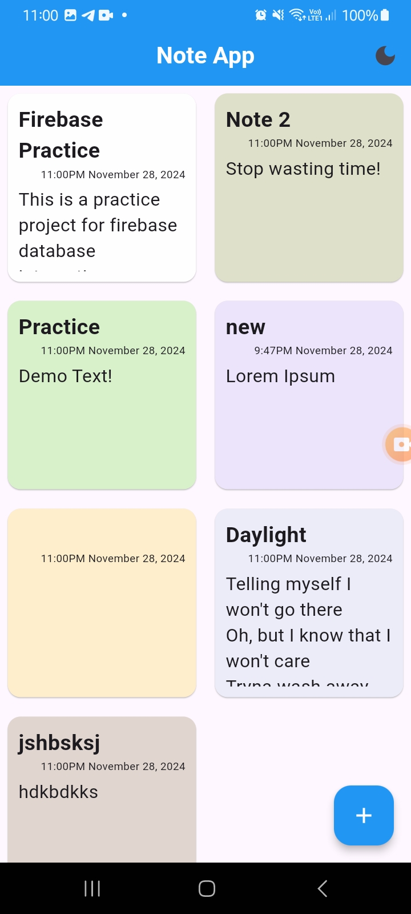
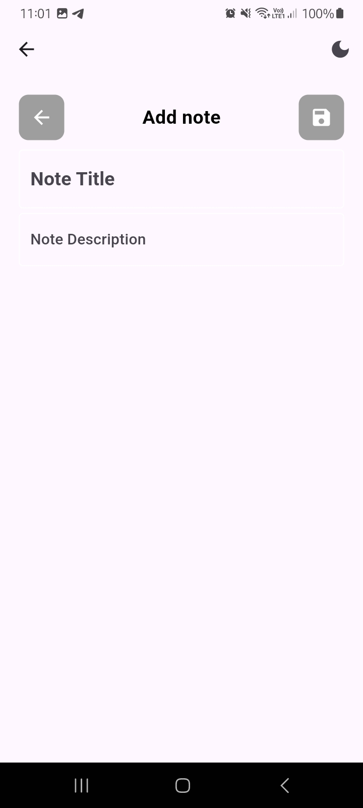
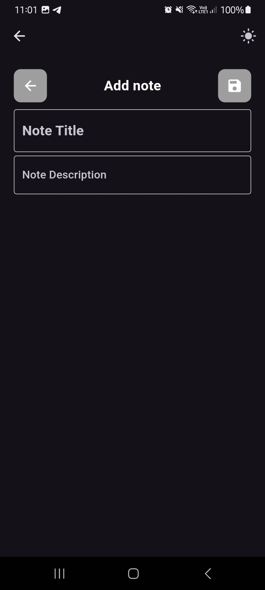
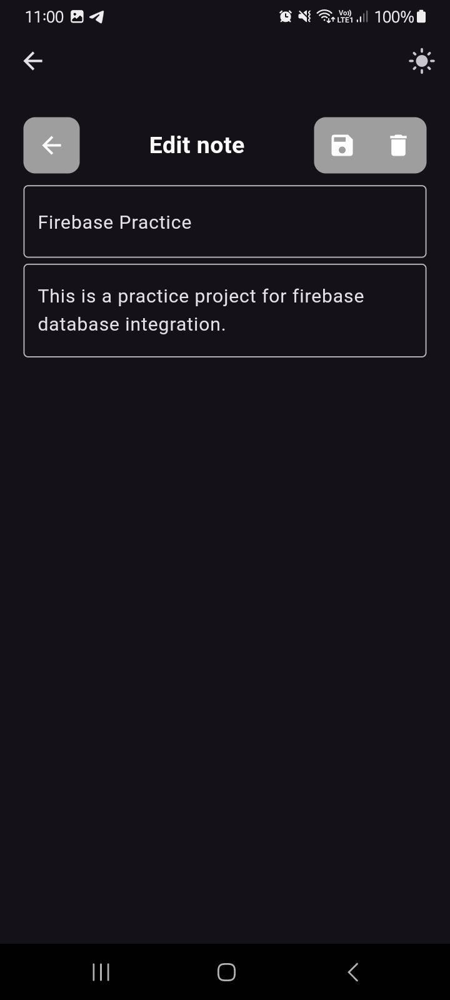
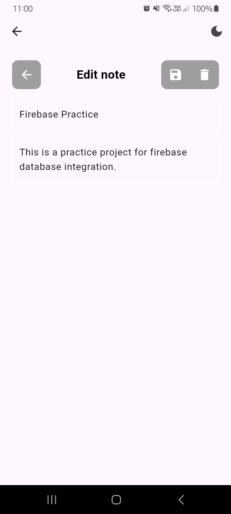

# Firebase CRUD Notes App

A Flutter-based **Notes App** with **Firebase integration**. This app supports **CRUD operations** and includes a modern UI with **light and dark modes**.

---

## Features

- **Create, Read, Update, and Delete Notes**
- **Light and Dark Theme Modes**
- **Real-time Firebase Firestore Integration**

---

## Screenshots

<!-- Second row -->

